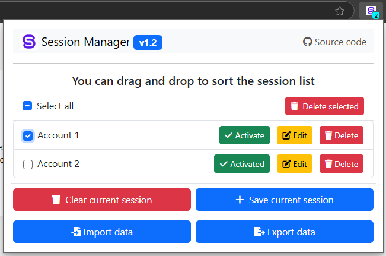

<h1 align="center">
	 Session Manager Extension
</h1>

## 👁️ Overview
The **Session Manager** extension helps users manage browser session data effectively. It allows quick switching between accounts by saving and restoring **Cookies**, **Local Storage**, and **Session Storage** for specific websites.

## 🚀 Features
- Save current session data (Cookies, Local Storage, Session Storage).
- Auto sync cookies, local storage, and session storage.
- Export and import session data for backup.
- Manage multiple sessions for different accounts.
- Activate a session to restore data for quick login.
- Edit and delete saved sessions.
- Clear current session data for a fresh start.

## ⚙️ Installation
1. Clone or download the **Session Manager Extension** repository.
2. Open **Google Chrome**.
3. Navigate to `chrome://extensions/` or `edge://extensions/`.
4. Enable **Developer mode**.
5. Click **Load unpacked** and select the extension folder.

## 📸 Screenshots
### List Sessions Saved
- **Empty List**

	

- **Sessions Saved**

	

### Create or Update Session	
- 

### Export or Import Sessions Data
- **Export Sessions**
	
	

- **Import Sessions**
  
	

## 📖 How to use
1. Click the **Session Manager** icon in the browser toolbar to open the popup.
2. **Save Current Session**:
   - Click the **"Save current session"** button.
   - Enter a session name and select data to save (Cookies, Local Storage, Session Storage).
   - Click **Save**: The session will be added to the list and clear the current session and reload the page.
   - Click **Save (keep current session)**: The session will be added to the list without clearing the current session.
3. **Activate a Session**:
   - Select a session from the list and click **"Activate"**.
4. **Edit or Delete a Session**:
   - Use the **Edit** or **Delete** buttons for the corresponding session.
5. **Clear Current Session**:
   - Click the **"Clear current session"** button to clear the current session data and reload the page.

## 🛠️ Permissions
The extension requires the following permissions:
- **Storage**: To save and retrieve session data.
- **Cookies**: To manage cookies for the current site.
- **Tabs and Active Tab**: To interact with the current tab.
- **Scripting**: To inject content scripts dynamically.
- **Host Permissions**: For access to all URLs.

## 📜 Notes
- Ensure cookies are enabled in your browser for the extension to function correctly.
- The extension supports dynamic injection of content scripts for flexibility.

## 📝 Author
**NTKhang**  
**Description**: Manage sessions to switch accounts quickly.

## 📄 License
This project is licensed under the GNU General Public License v3.0 - see the [LICENSE](/LICENSE) file for details.

## 🙏 Acknowledgments
Thank you for using the **Session Manager Extension**. If you have any questions or feedback, please open an issue on [GitHub](https://github.com/ntkhang03/SessionManagerExtension/issues)